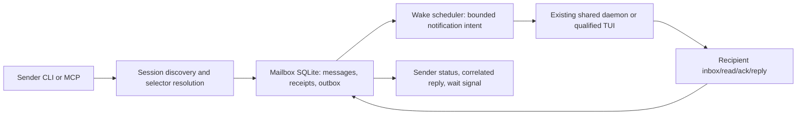

# Local agent-to-agent communication system

State: OPEN
Lane: P63
Depends-On: P62 / Plan 0100
Owner: primary integration lane

## Current state

Execution authorized by the operator under the active Plan 0101 goal.
Checkpoint before 750,000 goal tokens. Effect-specific live gates below remain
applicable. Work item: https://github.com/CochranResearchGroup/codex-wake/issues/181.
Branch: feat/p63-session-discovery; target: origin/main; integration: squash PR.
Plan 0100 defines session discovery and Byobu selectors; its implementation is
pending. Existing Wake supplies durable wake records, bounded scheduling,
exact-thread tmux routing, safety classification, and transport receipts.
Its current app-server adapter launches a separate stdio server. A read-only
probe demonstrated discovery on the existing shared daemon's Unix WebSocket
endpoint. Shared-daemon delivery, message storage, recipient consumption, and
cross-root enrollment are not implemented or accepted.

## Objective and product outcome

An agent in tab `17:wake` can address another agent as `7:mail-receipts`, send
a durable request, see whether it was stored/notified/received, and receive a
correlated reply. The recipient's thread remains the intended identity after
tab rename, move, closure, or restart. Ordinary agent work and human input
retain their existing ownership and approval boundaries.

## Scope

Local communication among Codex threads under one OS user, across repositories
explicitly enrolled in one messaging bus. Implement CLI first, with an optional
MCP facade over the same primitives. Support notices, requests, results, inbox
inspection, recipient acknowledgements, replies, cancellation, reconciliation,
bounded notification, message waiting, diagnostics, and lifecycle retention.
Independent Codex sessions and subagents are both addressable by exact identity;
parent/child relationships do not automatically grant mailbox access.

Exclude cross-user/remote federation, broadcast, automatic agent spawning,
agent task allocation, arbitrary code execution, provider-specific integration,
external email/Slack sends, and autonomous recursive delegation. Offline resume
and mid-turn steering are follow-on capabilities, not default delivery behavior.

## Authority and identity

1. Operator-selected bus enrollment and delivery permissions govern effects.
2. A thread key is `(bus_id, runtime_namespace, thread_id)`. Namespace includes
   the canonical Codex home/provider runtime identity; a daemon incarnation is
   a connection generation, not a new durable recipient identity.
3. Plan 0100 selectors resolve at send acceptance. Store the exact recipient
   key and selector observation. Never resolve a delayed message by tab again.
4. Sender identity comes from runtime context validated against the daemon;
   inherited environment or a claimed `--from` alone does not authenticate it.
5. Root/cwd and tab title help matching but do not confer membership or rights.
   Identical title/cwd, split panes, unavailable sources, or mismatched process
   generations block selection instead of producing a guessed sender/recipient.
6. `messages inbox/read/ack/reply` default to the invoking thread. Agent tools
   cannot read another mailbox by simply supplying its ID. Explicit operator
   inspection is a distinct auditable action, not an agent identity bypass.

Start with Plan 0097's `metadata_matched` binding for discovery. Before automatic
TUI delivery is accepted, qualify a runtime-issued thread-to-client binding
from available hook/runtime payloads: exact thread, PID/start ticks, pane/socket,
namespace, observation time, and freshness policy. Do not name a model-written
environment claim an attestation. Verify which hooks actually expose these
fields. If the installed runtime cannot supply sufficient evidence, mark this
capability unavailable and retain manual pull plus qualified shared-daemon
exact-thread delivery. Same-UID local processes remain in one trust boundary;
owner-only permissions and capabilities do not isolate a malicious same-UID
process. Agents with unrestricted filesystem access can bypass mailbox APIs.

## Architecture and ownership

One local mailbox authority owns immutable envelopes, durable recipient
sequence, idempotency, cancellation, read receipts, acknowledgements, and
transactional outbox. Existing Wake remains scheduler/transport authority.
Do not make wake files, hook acknowledgements, or transcripts an alternative
mailbox authority. Discovery owns observations, not permission to send.
CLI and optional MCP both call one service API, not separate stores or logic.

Use a proposed owner-only bus root
`$XDG_STATE_HOME/codex-wake/a2a/<bus-id>` (default state home `~/.local/state`).
Contain `mailbox.sqlite`, schema metadata, nonsecret enrollment policy, and
bounded diagnostic receipts. Bus identity must be stable and checked against
its canonical root; copying a database cannot silently create a second active
writer for the same bus. Root directory mode 0700, files 0600; reject symlink,
wrong-owner, and unsupported network-filesystem state roots.

Enrolled repositories point to this bus; they do not each create competing
mailboxes. Integrate one bus dispatcher with the existing user supervisor or
one explicitly selected Wake service owner. Do not start one dispatcher/MCP
server per loaded session. A global dispatcher lease and per-recipient lease
with fencing generations protect claims across competing workers. SQLite
transactions establish correctness; filesystem locks are supplementary.

## Agent-facing verbs

The `sessions` verbs remain Plan 0100's read-only interface.

| Verb | Contract |
| --- | --- |
| `messages send --to REF --body-file FILE` | Validate sender/recipient and atomically accept one immutable envelope |
| `messages inbox` / `outbox` | Bounded metadata lists for the invoking thread, with filters and cursors |
| `messages show ID` | Envelope metadata, lifecycle, transport attempts, and receipts |
| `messages read ID` | Return body to recipient; record an idempotent retrieval receipt |
| `messages ack ID --outcome accepted\|declined\|completed\|failed` | Explicit recipient disposition, with optional evidence pointer |
| `messages reply ID --body-file FILE` | Atomically accept reply and link it to the original conversation |
| `messages cancel ID` | Sender/operator cancels work not yet claimed for transport |
| `messages wait ID --for received\|reply --timeout 5m` | Bounded foreground receipt observation, not implicit agent execution |
| `messages watch [ID] --duration 5m` | Bounded JSONL metadata/lifecycle observation |
| `messages reconcile ID` | Inspect ambiguous notification outcome and reconcile exact evidence |

Body input also supports stdin with `--body-file -`; avoid large/sensitive body
arguments and logs. `send` supports `--kind notice|request|result`, `--ttl 24h`,
`--idempotency-key KEY`, and `--delivery inbox|notify` (default notify subject
to enrollment). Explicit key is required on machine-driven send/reply. For
human CLI, generate and return the key before any ambiguous outcome; recommend
reusing it after interruption. Atomic identity pinning happens before success.
No `--force`, arbitrary sender impersonation, fuzzy recipient, or blind resend.

`show` hides body by default; authorized `read` returns it. Sender body access
is limited to its own outbox. Read-only inspectors do not mark a message read.
Operator `--as-operator` inspection requires the configured operator capability
and records who inspected which mailbox; it is an audit boundary within a
same-UID runtime, not a claim of OS isolation.

Operator-only `a2a configure`, `enroll`, `status`, `doctor`, `pause`, `resume`,
`retention preview`, and `retention apply` govern the bus. Pause stops new
notifications, leaving accepted messages inspectable. Enrollment sets allowed
send/receive roots or explicit thread keys, cross-root rules, and automatic
notification capability. These are explicit operator operations. No automatic
root enrollment inferred from discovery or message content.

All commands emit a versioned JSON envelope with typed error codes and receipt
IDs. Preserve Plan 0100 selector error semantics; distinguish authorization,
store unavailable, idempotency conflict, capacity, and uncertain effect errors.
CLI nonzero exits must return reconciliation pointers for uncertain writes.

## Envelope and storage contract

Immutable message fields: schema version, bus ID, message ID, conversation ID,
sender and recipient keys, kind, body UTF-8, body digest, created_at, expires_at,
idempotency key, in_reply_to, request correlation, lineage/hop count, and
selector observation. No executable trigger or arbitrary transport command.
Default body limit 32 KiB, optional subject 200 characters, text only in v1.
No attachment ingestion; local artifact pointers are references and never
implicitly fetched or granted access.

Mutable records are separate: recipient sequence, read/disposition receipts,
notification attempts, claims/leases, deadlines, terminal events, and outbox
items. Preserve attributable events; derived projections may be rebuilt.
Unique constraint `(bus_id, sender_key, idempotency_key)` returns the original
message for an identical request; conflicting recipient/body/kind/expiry is
rejected. Allocate per-recipient FIFO sequence in the acceptance transaction.
Reply acceptance and any optional acknowledgement must commit together.
Reply permission is limited to the original recipient, targets the original
sender, and preserves conversation lineage; an arbitrary new recipient is a
new send, not a reply. Different reply keys permit multiple intentional replies.

Use SQLite WAL, bounded busy timeout, explicit transactions, schema migrations,
and version-aware readers. Fail closed on unsupported schema, corruption, disk
full, clock anomalies, or ownership mismatch. Never return accepted until the
commit succeeds. No automatic destructive repair or reset of the mailbox.

## Lifecycle and evidence semantics

Keep three independent projections; never flatten them into one success flag.

| Projection | States and evidence |
| --- | --- |
| Message admission | `accepted`, `cancelled`, `expired`; commit and explicit event |
| Notification | `pending`, `deferred`, `dispatching`, `submitted`, `uncertain`, `failed`, `suppressed`; transport receipt and exact identity |
| Recipient | `unread`, `received`, `accepted`, `declined`, `completed`, `failed`; recipient-authorized retrieval/disposition receipts |

Acceptance is durable storage, not notification. `submitted` is transport
acceptance, not recipient receipt. A TUI hook acknowledgement proves prompt
submission only. `received` proves body retrieval by the authorized recipient,
not reasoning or completion. `completed` is an attributable recipient claim;
its evidence pointer may support validation, but the bus does not certify work.
A result reply does not silently mark the request completed.

Expiration stops new notification and first processing claims. Bodies remain
inspectable for retention, with expired state explicit. A claim accepted before
expiry may report its outcome later; expiry does not cancel already authorized
external work. Terminal receipts remain append-only. Cancellation before a
transport claim atomically suppresses its outbox. Once dispatch is claimed,
cancel returns `too_late` or `effect_uncertain`, not a promise to retract a prompt.
A requested cancellation of already received work is a new correlated message.

## Notification and runtime delivery

Default active recipient behavior is queue in the mailbox; do not steer or
interrupt it. Default unloaded/offline behavior is hold until the same exact
thread becomes eligible or TTL expires; do not create a replacement session.
Inbox-only mode never produces a turn. Idle status alone is insufficient:
recheck active flags, queued work, route generation, enrollment, and transport
safety at claim time. No paste into approval UI, foreign shell, human draft, or
uncertain composer. Preserve Plan 0099's bounded UI checks and separate safety
deferrals from actual sends.

Preferred adapter connects to the existing shared daemon and uses supported
exact-thread operations. Acceptance must establish how it handles races with
human input and other clients, including which operation can start a turn
without resuming/subscribing an already loaded thread. If the installed
protocol cannot do this safely, expose the capability as unavailable. Never
fall back silently to a separate stdio runtime on the same thread.

Qualified TUI adapter injects only a small canonical notification containing
bus/message or bounded inbox-batch IDs. Hook output may validate the envelope
and supply retrieval instructions; it must not promote peer-authored body text
into developer/system instructions. Peer content remains attributed untrusted
input subordinate to the recipient's governing task and policy. A hook runs
only on its actual runtime event; it is not independently an idle push channel.
Do not overwrite an existing human composer or infer readiness from spinner.

One in-flight notification per recipient; FIFO by accepted sequence, with
bounded coalescing (at most 20 IDs/notification) to avoid a turn per message.
Large backlogs remain in the mailbox. Recipient processing acceptance (`ack --outcome accepted`) atomically claims
work, keyed by recipient plus message ID; the reader generation fences the
claim owner but does not reset deduplication after restart. Retrieval (`read`)
records receipt only, not a work claim. Concurrent attachments cannot claim
the same item twice. Recover abandoned claims explicitly with evidence.
Do not promise exactly-once effects performed by an LLM or external provider.

After a transport accepts a notification, absent recipient ack alone does not
permit automatic replay. On an interrupted connection or crash after send,
mark `uncertain`, inspect exact transport/turn/hook/recipient evidence, and
reconcile before any reattempt. Unsupported or unavailable evidence keeps the
attempt uncertain for operator disposition. Retrying a provably unsent attempt
reuses the message ID and idempotency key; it never creates a new message.

## Crash recovery and scheduler integration

Acceptance transaction inserts envelope, recipient sequence, and notification
outbox intent. Outbox publisher creates a deterministic wake/job projection
and records its exact mailbox intent ID. SQLite and wake JSON are not one
transaction: tolerate crashes before/after publication, reconcile deterministic
IDs, and revalidate journal authority at dispatch. A wake file alone cannot
legitimize a cancelled, expired, foreign, or uncommitted intent.

Claim dispatch under the recipient lease, persist attempt intent before external
I/O, then record observed outcome. Lease expiry fences journal writes but cannot
retract an already sent external operation. An expired `dispatching` lease is
`uncertain`, not automatically eligible for resend. Surviving services reconcile
or hold it. Daemon incarnation changes invalidate connection handles and fresh
liveness observations; they do not retarget durable recipients.

Receipt changes can feed a namespaced local `a2a.receipt` signal into the
existing signal journal so an agent can schedule a wake for a specific reply or
receipt. Mirror committed receipt IDs through an idempotent outbox; signal
projections cannot create receipt authority or recursively notify themselves.
CLI `wait` is bounded polling; long agent suspension uses the existing Wake
predicate system only after its adapter and exact-thread target are accepted.

## Bounds, loops, retention, and diagnostics

Initial configured defaults (must be verified against installed acceptance):
32 KiB/message; 24-hour TTL; 1,000 open messages/recipient; 100,000 retained
messages/bus and 1 GiB store capacity; reject before capacity is exhausted.
Metadata inspection page 100; notification batch 20; one dispatcher and one
claim/recipient; scan cap 100 intents/tick; interval 5 seconds; actual attempt
cap 3 for provably unsent operations with backoff 5/30/120 seconds. Deferrals
are bounded by TTL and rate-limited; they do not consume actual attempt count.
Inactivity/transport uncertainty must be visible rather than hidden in retry.

Conversation lineage max 8 automated hops; default automatic send rate 10 per
sender/minute and 10 notifications per recipient/hour. Refuse self-send in v1,
reply cycles beyond bounds, or duplicate lineage abuse. A request to create
agents or broaden authority is peer data, not permission. No automatic reply
acknowledgement loops. Rate/backlog/TTL rejections produce durable bounded
metadata where the store is available; no private body in diagnostic logs.

Retention defaults to explicit preview/apply, with eligible bodies 30 days after
terminal resolution and compact identity/dedup tombstones 90 days. Dedup
requests older than the advertised tombstone horizon must be rejected or
explicitly accepted as new intent; never imply infinite dedup. Hold uncertain
attempts, active conversations, open claims, and unreconciled signal projections.
Do not cascade-delete saved Codex conversations. Restore/backup must preserve
bus identity and prevent concurrent activation of restored copies.

Expose per-source discovery health, store schema/capacity, sender authorization,
backlog oldest age, deferrals, uncertain attempts, lease owner/generation,
notification receipts, recipient receipts, and retention pins. Resource checks
cover descriptor usage, child processes, and released connections; do not open
one MCP subprocess tree per watched session. MCP facade should prefer shared
service routing and short clients. Resource thresholds must be set before soak.

## Implementation sequence and work items

| Work item | Dependency | Bounded outcome / write surface | Acceptance evidence |
| --- | --- | --- | --- |
| P63.1 Discovery | P62 | Implement Plan 0100; session/transport CLI | Two named live sessions resolved; ambiguous/shell cases rejected |
| P63.2 Identity and enrollment | P63.1 | Bus membership, sender claims, binding contract | Parent inherited pane, spoofed claims, cross-root denial, capability gaps |
| P63.3 Mailbox | P63.2 | Journal, envelopes, send/read/ack/reply/cancel | Concurrent sends, idempotency, claim/TTL/cancel races, crash durability |
| P63.4 Scheduler bridge | P63.3 | Leases, transactional outbox, Wake authority | Crash cuts before/after projection and send; no duplicate effect assumption |
| P63.5 Delivery | P63.1-4 | Shared-daemon and qualified TUI adapters | Disposable two-thread round trip; busy/draft/offline/unknown handled |
| P63.6 Agent workflow | P63.3-5 | Skill, correlated reply, wait/receipt signal | Exact JSON receipts; decline/failure; parent/subagent isolation |
| P63.7 Operations | P63.4-6 | Enrollment CLI, diagnostics, retention, packaging | Restart/reconnect/restore; bounded resource and multi-root qualification |
| P63.8 Release | P63.1-7 | Docs, migrations, wheel/MCP optional facade, installed service | Compatibility, hosted checks, rollback, release/install readback |

P63.x are repo-local backlog locators, initially READY only after their packet
inputs are frozen; P63.1 is blocked on accepting the P62 implementation packet.
Detailed child plans derive just in time. Do not mark the campaign complete from
a passing mailbox unit suite or one live round trip.

One primary owner controls schema, identity, effect claims, and integration.
After interfaces freeze, mailbox provider-free tests and discovery fixture
work can run independently; delivery and shared CLI integration serialize.
This planning turn uses one lane; no delegated code discovery is required.
Optional later reviewer gets a frozen boundary and findings ledger, with no
scope/effect authority. Work-unit attempts max 2, review/rework max 1, discovery
review passes max 1, checkpoint after each packet. Exhaustion requires bounded
replanning, not blind retry or a new identity to reset limits.

## Validation and live gates

Provider-free acceptance first: CLI schemas/errors; malformed selectors;
identical names/cwd; concurrent readers/writers; busy/unloaded/offline; foreign
pane/PID reuse; ambiguous sends; clock jumps; disk full/corruption; migration;
crashes at each outbox/claim/I/O boundary; cancellation/expiry races; duplicate
notification; FIFO/coalescing; ancestry; limits; retention/tombstones; shutdown.
Reuse public dispatch and signal tests where behavior overlaps; keep existing
wake transports compatible. Never use private mailbox bodies as fixtures.

Installed gate requires explicit named disposable sender/recipient threads,
chosen enrolled roots/bus, maximum sends (initial round trip: one request, one
reply), finite timeout, no provider effects, cleanup ownership, and preserved
receipts. Verify both recipient acknowledgement and sender reply readback.
A separate restart packet exercises same-thread recovery and unloading without
interrupting existing workflows. Multiroot production enrollment and supervisor
installation require their own concrete scope; no automatic enrollment during
planning or tests. Observe OS process/descriptor state before and after each
live packet. Hosted CI, installation, release, and runtime readback remain
separate evidence boundaries.

## Compatibility and rollout

New mailbox schema is independent of existing wake schemas 1 and 2. Introduce
reader/version capability probes before writing new message-linked wake
extensions. Older binaries must reject unsupported records visibly; no silent
ignore. Stage transport read support, then discovery, then inbox-only bus,
then disposable notifications, then explicit enrolled-root rollout. Existing
timer/file/signal wakes and stdio app-server callers retain their contracts.

Rollback pauses the bus dispatcher and preserves accepted records. It must not
replay unknown submissions, reset idempotency, downgrade a store in place, or
require deletion. Compatibility readers and retained versioned backups keep
inspection available. Secrets and private message bodies stay in user state.
No automatic copying into Git, support exports, or Graphiti. Authorized
recipient retrieval deliberately places the body in that agent's context and
may reach its configured inference provider; enrollment must make this audience
explicit. Diagnostics and notification prompts contain identifiers, not bodies.

## Decisions to verify before implementation

- Supported default daemon locator and WebSocket client dependency/version.
- Read/turn operations, subscriber side effects, and atomic busy behavior on
  installed Codex; exact target without spawning a second runtime.
- Actual hook identity fields and safe composer/peer-content handling.
- User-supervisor integration, enrolled-root ownership, and crash authority.
- Local capability mechanism and accurate same-UID threat description.

These are qualification packets, not invitations to expand scope. Unavailable
capabilities remain explicit; manual inbox messaging can ship before automatic
TUI push, offline resume, steering, or remote federation.

## Acceptance criteria and definition of done

The user can list sessions by Byobu tab, send to a selected exact thread,
retrieve/acknowledge/decline a message, reply to the sender, and inspect truthful
receipt history across busy periods and restarts. No wrong pane, wrong sender,
duplicate acceptance, silent message loss, or fabricated processing success
passes acceptance. Ambiguous notification effects reconcile or stay held.
Installed two-agent round trip, provider-free fault matrix, multi-root policy,
resource bounds, migration/rollback, hosted checks, and release readback must
all have attributable evidence before implementation is declared complete.

Design closeout: Plan 0101, P63 roadmap entry, P62 dependency wiring, and dated
runbook agree and documentation checks pass. This fulfills the planning request;
product implementation and any live messages remain pending.

## Next action

Freeze and implement the P62 shared-daemon discovery packet before opening
mailbox delivery work. Retain this campaign's outcomes and dependencies while
creating bounded child plans as their prerequisites become verified.

## Execution checkpoint 1

Issue #181; branch feat/p63-session-discovery. Read-only shared Unix WebSocket
reader implemented with maintained websockets dependency, a whole-observation
time budget, owned-socket checks, paginated population bounds, exact thread
identity checks, and an explicit metadata field allowlist. Eight targeted tests
pass. Discovery CLI, supported default endpoint locator, Byobu selectors, and
installed read-only acceptance remain pending. No message delivery performed.

## Execution checkpoint 2

P62 discovery accepted and PR #182 merged at canonical
9b43ab7a0d653dfcb05c8978e78971220cf4e9bf after both hosted Python gates.
P63.2 identity/enrollment is underway on docs/p63-budget-checkpoint under child
Plan 0102. Private bus, explicit capabilities, namespace/thread/root checks,
revocation, copied-root refusal and honest partial receipts are implemented.
Mailbox admission and delivery have not started. Goal meter: 324,615 tokens
at this checkpoint's validation start. Checkpoint at or before 700,000 tokens
to provide margin below the operator's 750,000 stop boundary.

P63.2/P63.3 integrated in PR #183, canonical 42893b190eb19c30dc702b2377893b1ba5736b88, hosted Python 3.11/3.12 gates successful. Plan 0104 now owns the scheduler bridge; full campaign remains OPEN.

PR #184 integrated bounded scheduler/receipt library at 6d4c399e11f3c08b5a048c61579675657cabcb08. Plan 0105 implements independent operations foundations; live delivery, receipt CLI/restore, service and release gates remain OPEN.

## Budget checkpoint and continuation authority

User instruction remains execute the full plan and stop/checkpoint before
750,000 goal tokens. The working threshold is at or before 700,000. At the
625,906-token packet boundary, integrated the operations foundation and prepared
a restart-safe checkpoint before beginning the materially larger live-delivery
proof. Final meter is reported at pause. This stop follows the explicit user
budget instruction; it is not acceptance or a request to narrow the goal.

State remains OPEN. Continuation locator:
`docs/dev/notes/0002-2026-10-03-plan0101-budget-checkpoint.md`.
No automatic notification or actual live two-agent acceptance is claimed.

## Resumption with increased cumulative ceiling

Operator raised the cumulative ceiling to 1,500,000 on 2026-10-03. Preserve
prior usage; checkpoint by 1,400,000 to retain margin. The earlier 750,000
records remain historical evidence, not the current execution ceiling.
Plan 0106 accepts the bounded foreground disposition workflow only, with
verification 0099. Verification 0098 records installed schema and official
release-source queue behavior; automatic delivery remains unqualified because
composer/client identity and installed provenance are not established.
Full system acceptance, long receipt suspension, daemon restore, actual named
agents, lifecycle/resource qualification, service and release remain open.

Plan 0107 qualifies the explicit receipt restore/source-guard seam, verification
0100. Production authority configuration and long-suspension CLI remain
unfinished; default daemon receipt discovery is not implied by registration.

## Post-reboot integration and configured observer packet

PR #188 integrated at ff37005b0271b631c5dffa2e1c630d241761826a after
Python 3.11/3.12 gates passed on repaired head e107ee39d467244def698d9336208144eced3631,
run 37154989267. Verification 0100 retains the original hosted failure and
the diagnosed test-fixture sensitivities. Integration does not close Plan 0101.

Plan 0109 owns opt-in independent receipt observer configuration and executable
no-dispatch restart proof. It delegates operator inspection rather than
fabricating live actor runtime metadata. Long agent suspension and its arming
CLI remain separate successors because exact-thread delivery is unqualified.
The latest operator cumulative ceiling is 2,250,000; prior budget records and
usage remain preserved. No active goal meter is present in this session.

## Receipt arming prerequisite

PR #189 integrated at 75686bac66abd4be11cfbe865cb8918addfd0af5. Plan 0110
accepts an explicit independently granted receipt arming CLI, retaining the
active managed-reader gate and generic-dispatch hold. Verification 0102 records
fresh-command pending/replay/expiry/idempotency evidence and installed checks.
Actual agent suspension and qualified delivery remain OPEN.

## Active goal and delivery provenance refresh

Operator's current active goal is complete Plan 0101 and checkpoint before
500k on the current meter; working checkpoint 450k. Older cumulative ceilings
remain history, not the current stop instruction; inherited review and attempt
allowances are not reset. PR #190 integrated at 9c3bbe8. Plan 0111 / verification
0103 prove installed Codex identity against its official release asset and
confirm shared daemon metadata reads in the isolated installed environment.
Composer/client ownership and named disposable live delivery remain unqualified.
Prepared live boundary in verification 0103 does not authorize execution.

## Multiroot resource qualification

Plan 0112 / verification 0104 qualifies a bounded synthetic workload with default
limits, cross-root deny/allow, FIFO/idempotency, correlated replies, ten fresh
process reopens, copied-root refusal and installed resource census. No runtime
code changes or live actors. This advances operations/resource acceptance; full
live, service, retention, soak and release requirements remain OPEN.
